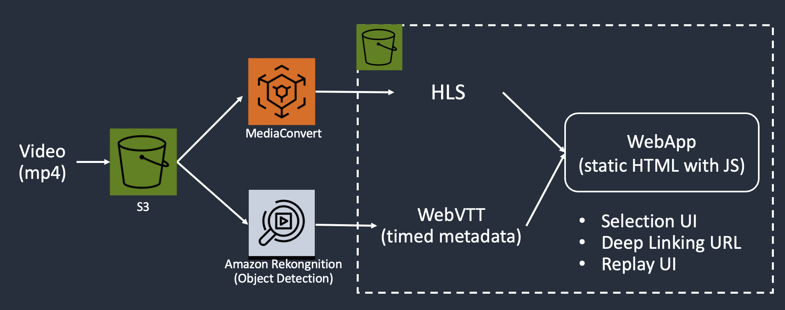

# awscdk-app-video-deep-linking-demo

AWS CDK app for deploying the necessary resources for the video deep linking demo

## Demo
Uploading a video file (mp4) to the input S3 bucket triggers the following jobs:
* Detect faces in the video using [Amazon Rekognition Person Tracking API](https://docs.aws.amazon.com/rekognition/latest/APIReference/API_GetPersonTracking.html)
* Transcode the video file into HLS streams using [AWS Elemental MediaConvert](https://docs.aws.amazon.com/mediaconvert/latest/ug/what-is.html)
* Store the geometry information obtained from the face detections in a [WebVTT file](https://www.w3.org/TR/webvtt1/#introduction-metadata) as timed metadata



## Install
1. Setup [CDK](https://docs.aws.amazon.com/cdk/v2/guide/getting_started.html) environment (including Node.js, Docker)

2. Install this CDK app
```
$ git clone https://github.com/kuu/awscdk-app-video-deep-linking-demo.git
$ cd awscdk-app-video-deep-linking-demo
$ npm i
```

## Deploy
```
$ npx cdk deploy
```

### Resources
The following resources will be deployed:
* AWS::S3::Bucket x 2
* AWS::Events::Rule x 1
* AWS::StepFunctions::StateMachine x 1
* AWS::Lambda::Function x 7
* AWS::SNS::Topic x 1
* AWS::SQS::Queue x 1
* AWS::CloudFront::Distribution x 1

### Outputs
After the deployment, the following information will be printed:
* InputBucket: S3 bucket to upload the input file to
* OutputBucket: S3 bucket to store the output files
* EventBridgeRuleName: The EventBridge Rule to recieve S3 notifications and trigger the StepFunction state machine
* HtmlUrl: WebApp HTML referring to the HLS and WebVTT files

## Cleanup
```
$ npx cdk destroy
```
